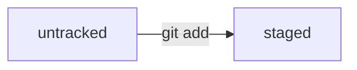

# Краткий конспект уроков по GIT

## Тема 1. Введение

### Урок 1. Описание модуля

В модуле обучимся самостоятельно работать над Git-проектом, в частности:

* создадите Git-репозиторий, добавите в него файлы и сделаете свой первый коммит;
* познакомитесь с GitHub — самой популярной платформой для хранения IT-проектов и командной работы над ними;
* научитесь синхронизировать локальный репозиторий, который хранится у вас на компьютере, с удалённым — тем, который вы заведёте на GitHub;
* изучите понятия хеш, лог, HEAD и другие — они помогут вам ориентироваться в коммитах;
* узнаете, как работать с изменениями и правильно оформлять коммиты.

## Тема 2. Первый коммит

### Урок 1. Инициализируем репозиторий

Чтобы инициализировать репозиторий, в папке проекта следует вызвать команду `git init`
При инициализации репозитория создаётся ветка по умолчанию - `main` или `master`

## Пробуем [mermaid](https://mermaid.js.org/) синтаксис

